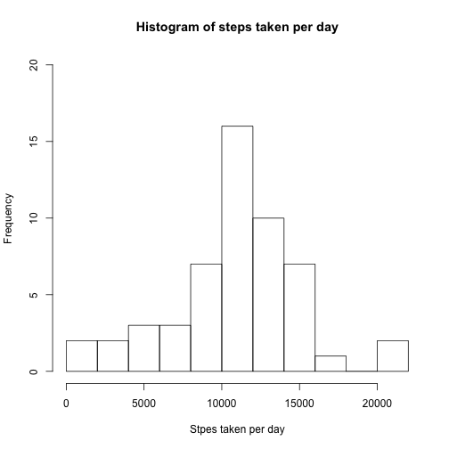
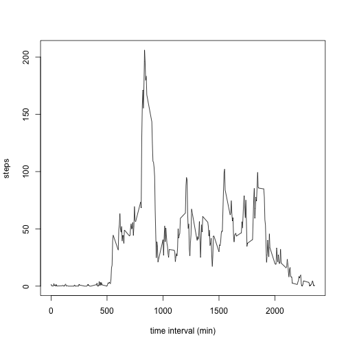
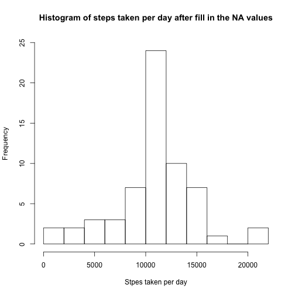
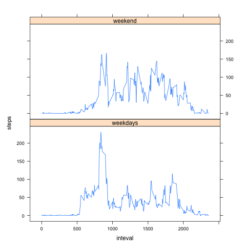

  This R Markdown file shows the analysis on the data from a personal activity monitoring device. This device collects data at 5 minutes intervals throughout
the day. The data consists of two months of data from an anomymous indic
 
 
 First set the global option "echo=TRUE" so tha the R code will be shown in the file.
 

```r
library(knitr)
opts_chunk$set(echo=TRUE)
```
 
## Read in the csv data.

```r
unzip("./activity.zip",exdir="./activity.csv")
activity<-read.csv("./activity.csv", header=TRUE)
```

```
## Error in read.table(file = file, header = header, sep = sep, quote = quote, : no lines available in input
```

```r
head(activity)
```

```
##   steps       date interval
## 1    NA 2012-10-01        0
## 2    NA 2012-10-01        5
## 3    NA 2012-10-01       10
## 4    NA 2012-10-01       15
## 5    NA 2012-10-01       20
## 6    NA 2012-10-01       25
```

```r
activity$date<-as.Date(activity$date,"%Y-%m-%d")
```

## 1. Calculate the mean total number of steps taken per day.

```r
Days<-aggregate(steps~date,data=activity,FUN=sum,na.rm=TRUE)
DaysMean<-mean(Days$steps)
print(DaysMean)
```

```
## [1] 10766.19
```

```r
DaysMedian<-median(Days$steps)
print (DaysMedian)
```

```
## [1] 10765
```

```r
hist(Days$steps,xlab="Stpes taken per day", ylab="Frequency", breaks=10,
     main="Histogram of steps taken per day",ylim=c(0,20))
```



The mean of the total number of steps taken per day is DaysMean=10766, and
the median of the total number of steps taken per day is DaysMedian=10765.

## 2. Plot the average daily activity pattern.

```r
Daily<-aggregate(steps~interval,data=activity,na.rm=TRUE,FUN=mean)
head(Daily)
```

```
##   interval     steps
## 1        0 1.7169811
## 2        5 0.3396226
## 3       10 0.1320755
## 4       15 0.1509434
## 5       20 0.0754717
## 6       25 2.0943396
```

```r
plot(Daily$interval,Daily$steps,type="l",xlab="time interval (min)",
     ylab="steps") 
```



```r
MaxStep<-max(Daily$steps)
print(MaxStep)
```

```
## [1] 206.1698
```

```r
MaxInterval<-Daily[which.max(Daily$steps),]$interval
print(MaxInterval)
```

```
## [1] 835
```

The 5-minute interval, at 835 minute, on average across all the days in the dataset contains the maximum number of steps, which is 206.

## 3. Imputing missing values and fill it with mean of that 5-min interval.

```r
NARowNum1<-sum(is.na(activity$steps))
print(NARowNum1)
```

```
## [1] 2304
```

```r
NARowNum2<-sum(is.na(activity$interval))
print(NARowNum2)
```

```
## [1] 0
```
The total number of rows with missing values is 2304. Now fill all
the NA values with the mean step of that 5-min interval across all day, which
we have calculated in the last section.


```r
activityFill<-activity
count<-0
for(i in 1:nrow(activityFill)){
        if (is.na(activityFill[i,]$steps)) {
                itv<-activityFill[i,]$interval
                activityFill[i,]$steps<-subset(Daily,interval==itv)$steps
                count<-count+1
        }
}
head(activityFill)
```

```
##       steps       date interval
## 1 1.7169811 2012-10-01        0
## 2 0.3396226 2012-10-01        5
## 3 0.1320755 2012-10-01       10
## 4 0.1509434 2012-10-01       15
## 5 0.0754717 2012-10-01       20
## 6 2.0943396 2012-10-01       25
```

```r
print(paste("Total number of NA which is filled is ",count))
```

```
## [1] "Total number of NA which is filled is  2304"
```
Now calculate the total number of steps taken each day with the missing value
filled in.

```r
NewDays<-aggregate(steps~date,data=activityFill,FUN=sum,na.rm=TRUE)
NewDaysMean<-mean(NewDays$steps)
NewDaysMedian<-median(NewDays$steps)
print(NewDaysMean)
```

```
## [1] 10766.19
```

```r
print(NewDaysMedian)
```

```
## [1] 10766.19
```

```r
hist(NewDays$steps,xlab="Stpes taken per day", ylab="Frequency", breaks=10,
     main="Histogram of steps taken per day after fill in the NA values",ylim=c(0,25))
```



After fill in the NA values with the mean step of that 5-min interval 
across all day, the mean and median value of total number of steps taken
each day is NewDaysMean=10766 and NewDaysMedian=10766. The mean value is the same as before we fill
in the NA value since we put in the mean value of that time interval for
the missing values. The median value is slightly increased (from 10765 to 10766).

## 4. Check if there are differences in activity patterns between weekdays and weekends.

```r
wkdays<-c("Monday","Tuesday","Wednesday","Thursday","Friday")
activityFill$wk<-factor((weekdays(activityFill$date) %in% wkdays),
                        levels=c(TRUE, FALSE), labels=c("weekdays","weekend"))

activityAve<-aggregate(steps~interval+wk, data=activityFill,FUN=mean)
library(lattice)
xyplot(steps~interval|factor(wk),data=activityAve,type="l", aspect=1/2,
       xlab="inteval", ylab="steps")
```


